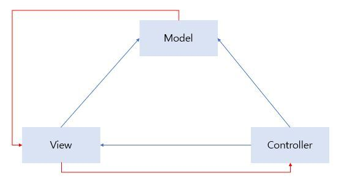

> 파란선은 직접적인 관계를, 빨간선은 간접적인 관계를 나타냅니다.
  

---
  

# MVC 패턴의 구성요소
  
1. Model
 - 모델의 상태에 변화가 있을 때 컨트롤러와 뷰에 이를 통보합니다. 
 이와 같은 과정을 통해서 뷰는 최신의 결과를 보여줄 수 있고, 컨트롤러는 모델의 변화에 따른 적용 가능한 명령을 추가·수정할 수 있습니다.
 
(ex. 처리되는 알고리즘, DB와의 상호작용, 데이터 등)
  

2. 뷰
 - 사용자가 볼 결과물을 생성하기 위해 모델로부터 정보를 얻어옵니다.
 
	(ex. 최종 사용자에게 보여지는 화면(UI)
  

3. 컨트롤러
 
 - 모델에 명령을 보냄으로써 모델의 상태를 변경할 수 있습니다.  또한, 뷰에 명령을 보냄으로써 모델의 표시방법을 바꿀 수 있습니다.
 
 

---
   
# MVC 패턴을 쓰는 이유는?
  

 > '효율적인 개발 및 유지보수를 위해서'
 
 페이지(view), 데이터 처리(Model), 이를 제어하는 컨트롤러(Controller)로 각각 분리하여 프로그램을 개발하면, 중복개발되는 부분을 방지할 수 있어 개발시 효율성이 증대될 뿐 만 아니라, 추후 프로그램의 유연한 확장성을 가질 수 있으며, 어떠한 부분에서 문제가 발생하더라고, 다른 부분에 최소한의 영향을 주며 변경할 수 있습니다.
 
  
---
   
# MVC 패턴의 단점?
 
MVC패턴에도 문제점은 있다.
 
Controller가 Model과 View에 대한 모든 처리를 담당하고 있기때문에, 어느선까지는 효율적인 관리가 가능하지만 프로그램이 복잡하고 무거운 대규모 프로젝트에서는 컨트롤러에 업무가 과중될 수 있다.
 
개발과 유지보수가 용이하도록 설계한 모델이지만 일정 수준이상의 복잡한 프로젝트에서는 수정시 테스트가 힘들고, 하나의 수정이 다른 부분에 영향을 미치는 등 역효과가 날 수 있다.
 
따라서 이러한 문제점을 개선할 수 있는 다양한 방법들 중 대표적으로 MVP,MVVM 등이 고안 됐다.
  

---
   
# 질문
  
 Q1. MVC 패턴의 장점?
 
 Q2. MVC 패턴의 문제점을 어떤식으로 개선할 수 있나?