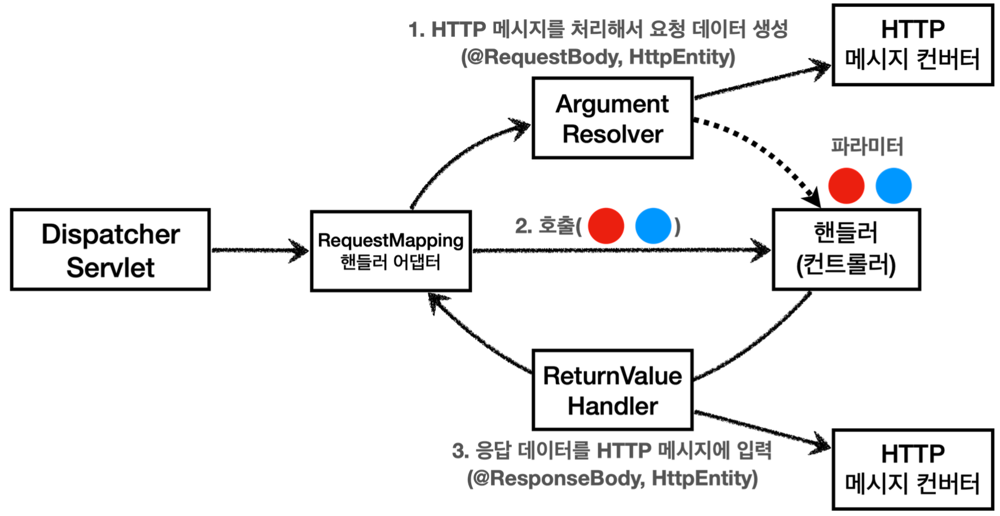

# Logging
- 성능이 좋음
- 별도의 위치에 파일로 관리
- 환경에 따라 로그 레벨을 조절
- 쓰레드 정보, 클래스 이름 같은 부가 정보

## library
spring-boot-starter-logging
- SLF4J
    - 인터페이스
- Logback
    - 구현체


## Declare
- ```private Logger log = LoggerFactory.getLogger(getClass());```
- ```private static final Logger log = LoggerFactory.getLogger(Xxx.class)```
- ```@Slf4j```

## Usage
- LEVEL: TRACE > DEBUG > INFO > WARN > ERROR
- 올바른 사용법: ```log.info("info log={}", name);```
- 잘못된 사용법: ```log.info("info log=" + name);```
    - 불필요한 문자 더하기 연산이 발생할 수 있음

# Request

## RequestMapping
### HTTP method
- ```@GetMapping```
- ```@PostMapping```
- ```@PutMapping```
- ```@DeleteMapping```
- ```@PatchMapping```

### PathVariable
- `@PathVariable`
    - 파라미터 이름이 같으면 생략 가능

## Header
- `@RequestHeader`
    - `MultiValueMap<String, String> headerMap`

## Parameter
[GET]쿼리 파라미터 & [POST] HTML Form

- `request.getParameter()`
    - HttpServletRequest 제공
- `@RequestParam` 
    - HTTP 파라미터 이름이 변수 이름과 같으면 `@RequestParam(name="xx")` 생략 가능
    - 단순 타입이면 `@RequestParam` 도 생략 가능
    - 과도한 생략은 지양
- `@ModelAttribute`
    - 동작 과정
        1. 객체 생성
        2. 파라미터 바인딩: 요청 파라미터의 이름으로 객체 프로퍼터의 setter 호출
    - argument resolver 로 지정해둔 타입 외 생략 가능

## HTTP message body
- `InputStream`
- `HttpEntity`
    - `RequestEntity`: HttpMethod, url 정보가 추가, 요청에서 사용
- `@RequestBody`
    - 생략 불가능

`HttpEntity` , `@RequestBody`는 **HttpMessageConverter**가 HTTP 메시지 바디의 내용을 우리가 원하는 문 자나 객체 등으로 변환
- JSON 요청 -> HttpMessageConverter(MappingJackson2HttpMessageConverter) -> 객체

# Response
## Static resources
- path: `src/main/resources/static`
## View template
Thymeleaf
- path: `src/main/resources/templates`
## HTTP message body
- `OutputStream`
- `HttpEntity`
    - `ResponseEntity`: HTTP 상태 코드 설정 가능, 응답에서 사용
- `@ResponseBody`
- `@RestController`
    - `@ResponseBody` 적용

# HttpMessageConverter
대상 클래스 타입과 미디어 타입 둘을 체크해서 사용여부를 결정
- `StringHttpMessageConverter` : `String` 문자로 데이터를 처리
    - 클래스 타입: `String` , 미디어타입: `*/*`
    - request: `@RequestBody String data`
    - response: `@ResponseBody return "ok"` 쓰기 미디어타입 `text/plain`
- `MappingJackson2HttpMessageConverter` : application/json
    - 클래스 타입: 객체 또는 `HashMap` , 미디어타입 `application/json` 관련
    - request: `@RequestBody HelloData data`
    - response: `@ResponseBody return helloData` 쓰기 미디어타입 `application/json` 관련

## RequestMappingHandlerAdapter

- ArgumentResolver
    - 애노테이션 기반 컨트롤러를 처리하는 `RequestMappingHandlerAdapter` 는 바로 이 `ArgumentResolver` 를 호출해서 컨트롤러(핸들러)가 필요로 하는 다양한 파라미터의 값(객체)을 생성
        - 애노테이션: HttpServletRequest , Model, @RequestParam, @ModelAttribute, @RequestBody, HttpEntity